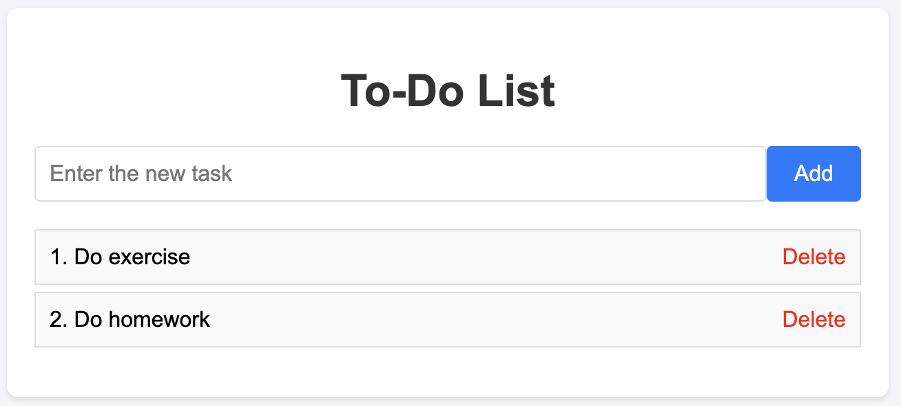

## Steps to follow
- Step 1: Code [login program](#11-login-program), [hrm program](#12-hrm-program) and [todo-app](#13-todo-app)
- Step 2: [Update user story](#2-update-user-story)
- Step 3: [Gen .feature file from user story](#3-gen-bdd-from-user-story)
- Step 4: [Gen steps file from (user story and code)](#4-gen-file-test)
- Step 5: [Fill body code from (steps file and code)](#5-gen-complete-file-test)
- Step 6: [Run test](#6-run-test)


=> To simplify the steps, see the [makefile section](#makefile).


### 1. Program

###### Setup enviroment:
    - cd source_code
    - python -m venv myenv
    - pip install -r requirements.txt
    - source myenv/bin/activate (Macos/linux)

The `.env` file contains the configuration for running the program.
```
OPENAI_API_KEY={your_key}
```

#### 1.1 Login program

A program for logging in with a username and password. The login is successful if the information is valid and fails if the information is invalid.

```
python login.py
```

View the `login.py` [file](./login.py)

Login screen:


Login successful:


Login failed:

#### 1.2 Hrm program
A program to add new employees, including their ID, name, and year of birth; after entering the details and clicking the "Save" button, the information will be displayed in a table.
```
python hrm.py 
```

View the `hrm.py` [file](./hrm.py)

Screen: 


#### 1.3 Todo App


How to run:
```
python todo-app/app.py
```

### 2. Update user story
Example: `As a user, I want to see a success message when I enter the correct username and password (username: admin, password: 1234) so that I know I have logged in successfully`

You can edit user story: [login](./user-stories/login.txt), [hrm](./user-stories/hrm.txt), [todo-app](./user-stories/todo-app.txt)

### 3. Gen BDD from user story
Currently, I have supported read code from a file or folder.

[`generate_bdd_of_folder.py`](./scripts/generate_bdd_of_folder.py) for folder case.

[`generate_bdd`](./scripts/generate_bdd.py) for a file case.

```
python scripts/generate_bdd.py
```

Contents of the output file:
```gherkin
Feature: Login Functionality

  Scenario: Successful login with correct credentials
    Given the user is on the login screen
    When the user enters username "admin" and password "1234"
    And clicks the login button
    Then a success message "Login Successful" should be displayed

  Scenario: Unsuccessful login with incorrect credentials
    Given the user is on the login screen
    When the user enters username "user" and password "123"
    And clicks the login button
    Then an error message "Wrong username or wrong password!" should be displayed

  Scenario: Unsuccessful login with empty credentials
    Given the user is on the login screen
    When the user leaves the username and password fields empty
    And clicks the login button
    Then an error message "Please enter username and password!" should be displayed
```
Detail: [login.feature](./features/login.feature), [hrm.feature](./features/hrm.feature), [todo-app.feature](./features/todo-app.feature)


### 4. Gen file test
`generate_step_definition.py` for both case.

```
python scripts/generate_step_definition.py
```

View the `generate_step_definition.py` [file](./scripts/generate_step_definition.py)

Example of the output file:
```python
from behave import given, when, then

@given('the login window is open')
def step_impl(context):
    # TODO: Implement step: the login window is open
    raise NotImplementedError(""" Step not implemented: the login window is open """)


@when('I enter the username "admin" and password "1234"')
def step_impl(context):
    # TODO: Implement step: I enter the username "admin" and password "1234"
    raise NotImplementedError(""" Step not implemented: I enter the username "admin" and password "1234" """)


@when('I click the "Login" button')
def step_impl(context):
    # TODO: Implement step: I click the "Login" button
    raise NotImplementedError(""" Step not implemented: I click the "Login" button """)


@then('I should see a success message "Login Successful"')
def step_impl(context):
    # TODO: Implement step: I should see a success message "Login Successful"
    raise NotImplementedError(""" Step not implemented: I should see a success message "Login Successful" """)
```

### 5. Gen complete file test

`generate_complete_step_of_folder` for folder case.
`generate_complete_step` for a file case.

```
python scripts/generate_complete_step.py
```

Example of the output file:
```python
from behave import given, when, then
from PyQt5.QtWidgets import QApplication
import sys
from login import LoginWindow

app = QApplication(sys.argv)
window = LoginWindow()

@given('the user is on the login screen')
def step_impl(context):
    window.show()
    context.window = window

@when('the user enters username "admin" and password "1234"')
def step_impl(context):
    context.window.username_input.setText("admin")
    context.window.password_input.setText("1234")

@when('clicks the login button')
def step_impl(context):
    context.window.login_button.click()

@then('a success message "Login Successful" should be displayed')
def step_impl(context):
    assert context.window.msg_box.message_text == "Login Successful"

@when('the user enters username "user" and password "123"')
def step_impl(context):
    context.window.username_input.setText("user")
    context.window.password_input.setText("123")

@then('an error message "Wrong username or wrong password!" should be displayed')
def step_impl(context):
    assert context.window.msg_box.message_text == "Wrong username or wrong password!"

@when('the user leaves the username and password fields empty')
def step_impl(context):
    context.window.username_input.clear()
    context.window.password_input.clear()

@then('an error message "Please enter username and password!" should be displayed')
def step_impl(context):
    assert context.window.msg_box.message_text == "Please enter username and password!"

```
Detail: [steps_login.py](./features/steps/steps_login.py), [steps_hrm.py](./features/steps/steps_hrm.py),
[steps_todo-app.py](./features/steps/steps_todo-app.py)

#### Makefile
- To automate the generation of step files. I wrote a [makefile](./Makefile) to simplify the execution.

    - A file case: You just need to execute the command `make gen_steps_of_file task={task}`. The `task` has two values: `login` or `hrm`. 

    - Folder case: You just need to execute the command `make gen_steps_of_folder task=todo-app`


### 6. Run test
`behave`
Output:
```
(myenv) lamtt@lamtts-MacBook-Air source_code % behave 
Starting tests...
Feature: Employee Management # features/hrm.feature:2
  As a user, I want to add employee information and display it in a table, so that I can manage employee records easily.
  Scenario: Add employee information and display in table                          # features/hrm.feature:5
    Given I have an empty employee form                                            # features/steps/steps_hrm.py:11 0.000s
    When I input "1" as ID                                                         # features/steps/steps_hrm.py:18 0.000s
    And I input "John Doe" as Name                                                 # features/steps/steps_hrm.py:22 0.000s
    And I input "1990" as Birth Year                                               # features/steps/steps_hrm.py:26 0.000s
    And I click the "Save" button                                                  # features/steps/steps_hrm.py:30 0.000s
    Then I should see a new row in the employee table with "1", "John Doe", "1990" # features/steps/steps_hrm.py:34 0.000s
    And the input fields should be cleared                                         # features/steps/steps_hrm.py:44 0.000s

  Scenario: Attempt to save without completing all fields        # features/hrm.feature:14
    Given I have an empty employee form                          # features/steps/steps_hrm.py:11 0.000s
    When I input "2" as ID                                       # features/steps/steps_hrm.py:18 0.000s
    And I input "" as Name                                       # features/steps/steps_hrm.py:50 0.000s
    And I input "1985" as Birth Year                             # features/steps/steps_hrm.py:26 0.000s
    And I click the "Save" button                                # features/steps/steps_hrm.py:30 0.000s
    Then I should see an error message "Please enter all fields" # features/steps/steps_hrm.py:54 0.000s
    And the employee table should not update                     # features/steps/steps_hrm.py:62 0.000s

Feature: Login Functionality # features/login.feature:2

  Scenario: Successful login with correct credentials             # features/login.feature:4
    Given the user is on the login screen                         # features/steps/steps_login.py:10 0.005s
    When the user enters username "admin" and password "1234"     # features/steps/steps_login.py:15 0.000s
    And clicks the login button                                   # features/steps/steps_login.py:20 2.852s
    Then a success message "Login Successful" should be displayed # features/steps/steps_login.py:24 0.000s

  Scenario: Unsuccessful login with incorrect credentials                         # features/login.feature:10
    Given the user is on the login screen                                         # features/steps/steps_login.py:10 0.000s
    When the user enters username "user" and password "123"                       # features/steps/steps_login.py:28 0.000s
    And clicks the login button                                                   # features/steps/steps_login.py:20 1.114s
    Then an error message "Wrong username or wrong password!" should be displayed # features/steps/steps_login.py:33 0.000s

  Scenario: Unsuccessful login with empty credentials                               # features/login.feature:16
    Given the user is on the login screen                                           # features/steps/steps_login.py:10 0.000s
    When the user leaves the username and password fields empty                     # features/steps/steps_login.py:37 0.001s
    And clicks the login button                                                     # features/steps/steps_login.py:20 0.989s
    Then an error message "Please enter username and password!" should be displayed # features/steps/steps_login.py:42 0.000s

Tests completed.
2 features passed, 0 failed, 0 skipped
5 scenarios passed, 0 failed, 0 skipped
26 steps passed, 0 failed, 0 skipped, 0 undefined
Took 0m4.963s
zsh: segmentation fault  behave
```


To generate test file. You can use command line: `make gen_steps_src task=todo-app`
### [Video test](https://www.youtube.com/watch?v=7d7hCxrpn_g) 
